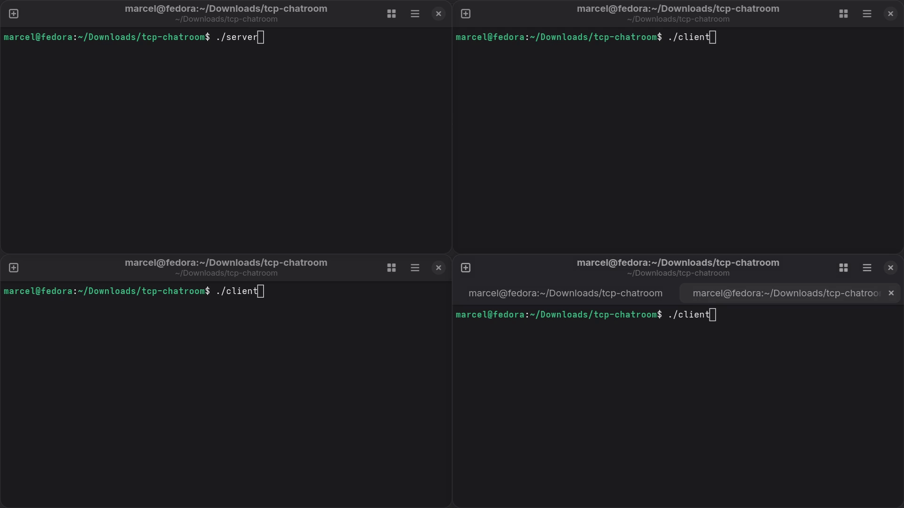

<h1 align="center">TCP Chatroom</h1>

<p align="center">
  
  
</p>

<br>

<p align="center">
  
</p>

---

## 📖 About

A **LAN terminal chatroom** over **TCP protocol**.
One machine runs the **server**, everyone else connects with the **client**:

- Public and private messages
- User list
- Admin can kick users
- When the admin leaves, another user becomes admin

## 🔨 Build

```bash
cd tcp-chatroom
g++ src/server/main.cpp src/server/Server.cpp -o server
g++ src/client/main.cpp src/client/Client.cpp -o client
```

Needs g++ 11 or newer. On older compilers add `-std=c++17 -pthread`.

## ▶️ Run

```bash
./server
./client
```

Start the server, then connect one client per terminal. The client connects to `127.0.0.1` by default.


## 💬 Commands

- **no prefix** - send a message to everyone
- **/private name text** - send a private message to an online user with name
- **/users** - show's a list of online people 
- **/kick name** - kick a user (admin only)
- **/quit** or **CTRL + D** - leave the chat 

## 📡 Protocol

Every message is one line, with parts split by `|`.

**Client -> Server**
````
JOIN|alice      - join as alice
MSG|hello       - message to everyone
PRIVATE|bob|hi  - private message to bob
KICK|bob        - kick bob (admin only)
USERS           - get users list
QUIT            - leave chatroom
````

**Server -> Client**
````
JOIN_OK                     - joined
JOIN_OK|ADMIN               - joined as admin (first user)
JOIN_FAIL|reason            - couldn't join (empty or taken name)
MSG|role|name|text          - public message
PRIVATE|role|name|text      - private message
USER_JOINED|name            - user joined
USER_LEFT|name              - user left
USERS|ADMIN:alice,USER:bob  - user list
ROLE|ADMIN                  - you're the admin now
KICKED|reason               - you got kicked
SYSTEM|text                 - server message
````
